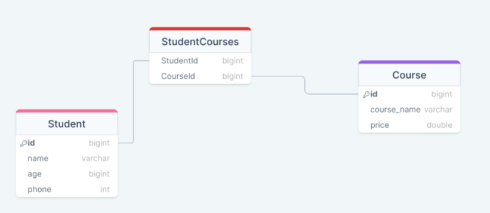

# 🎓 SQL Student-Course Project

This project showcases a relational database model for a basic student-course enrollment system using SQL. It includes schema creation, data insertion, and common query examples like filtering, joins, grouping, ordering, and more.

---

## 📁 Project Structure

```
sql-student-course-project/
│
├── README.md
│
├── /sql/
│   ├── 01\_setup\_schema.sql
│   ├── 02\_insert\_data.sql
│   ├── 03\_queries.sql
│   ├── 04\_constraints.sql
│
├── /docs/
│   ├── er\_diagram.png
│   ├── schema\_description.md

````
---

## 🧠 Key Concepts Covered

- ✅ Database normalization
- 🧩 Many-to-many relationships using a junction table
- 📥 Data population via `INSERT INTO`
- 🔍 Filtering data with `WHERE`, `LIKE`, `IN`
- 🔄 Sorting with `ORDER BY`
- 📊 Aggregations and `GROUP BY`
- 🔗 Inner `JOIN`s across related tables

---

## 🗃️ Database Schema

This project consists of three main tables:

1. `Students` – basic student info
2. `Courses` – list of available courses
3. `StudentCourses` – maps students to courses (many-to-many)

---

## 📊 ER Diagram



---

## 🚀 How to Run This Project

1. Clone the repository:
   ```bash
   git clone https://github.com/yourusername/sql-student-course-project.git
   cd sql-student-course-project
2. Open any SQL client (MySQL Workbench, DBeaver, phpMyAdmin, etc.)

3. Run the SQL scripts in order:

    * `sql/01_setup_schema.sql`
    * `sql/02_insert_data.sql`
    * `sql/04_constraints.sql`
    * `sql/03_queries.sql`

---

## 📄 SQL Scripts

### 🛠️ Setup

```sql
CREATE DATABASE thetestacademy;
USE thetestacademy;
```

### 📥 Sample Insert

```sql
INSERT INTO Students (name, age, phone) VALUES ("Chirag", 21, 2020202020);
```

### 🔗 JOIN Example

```sql
SELECT s.name AS Student, c.name AS Course
FROM StudentCourses sc
JOIN Students s ON sc.StudentId = s.id
JOIN Courses c ON sc.CourseId = c.id;
```

### 📊 Aggregation Example

```sql
SELECT age, COUNT(*) FROM Students GROUP BY age;
```

More queries available in `sql/03_queries.sql`.

---

## 📚 Documentation

Detailed schema and sample outputs:

* [`docs/schema_description.md`](docs/schema_description.md)

---

## 🙌 Contributions

Feel free to fork this project and explore additional queries, triggers, views, or database enhancements.

Let me know if you’d like this file exported or zipped along with the SQL and docs content!
