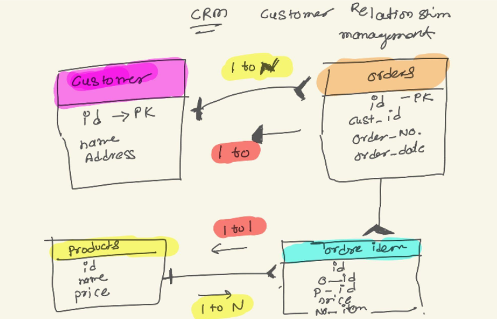

# 📊 CRM SQL Project

This project demonstrates the schema and SQL operations for a basic **Customer Relationship Management (CRM)** system. It covers core concepts such as table creation, data insertion, updating records, delete operations, views, stored procedures, triggers, and common SQL queries.

---

## 🗂️ Project Structure

```

crm/
├── docs/
│   ├── er\_diagram.png
│   └── schema\_description.md
├── sql/
│   ├── 01\_create\_tables.sql
│   ├── 02\_insert\_data.sql
│   ├── 03\_update\_queries.sql
│   ├── 04\_views\_triggers\_procedures.sql
│   ├── 05\_misc\_queries.sql
│   └── 06\_delete\_queries.sql
├── README.md

```

---

## 🧱 Database Schema

The CRM system uses four main tables:

- `customers`: Stores customer details.
- `products`: Stores product details.
- `orders`: Stores individual orders by customers.
- `order_items`: Stores product items per order.

There are relationships among these tables:
- `customers` ⟶ `orders` (One-to-Many)
- `orders` ⟶ `order_items` (One-to-Many)
- `products` ⟶ `order_items` (One-to-Many)



---

## 📂 SQL Files Overview

| File Name                     | Description                                                |
|------------------------------|------------------------------------------------------------|
| `01_create_tables.sql`       | Creates all tables: customers, products, orders, order_items |
| `02_insert_data.sql`         | Sample `INSERT` statements to populate each table          |
| `03_update_queries.sql`      | `UPDATE` statements for modifying existing records         |
| `04_views_triggers_procedures.sql` | Contains stored views, triggers, and procedures             |
| `05_misc_queries.sql`        | Aggregate functions, joins, filters, unions, self-joins     |
| `06_delete_queries.sql`      | Deletion operations and cleanup logic                      |

---

## 📄 Documentation

The `docs/` folder contains:
- `er_diagram.png`: Visual representation of the database schema
- `schema_description.md`: Description of tables and their relationships

---

## ✅ Key SQL Concepts Used

- Table design with constraints (`PRIMARY KEY`, `FOREIGN KEY`, `UNIQUE`)
- CRUD operations (`SELECT`, `INSERT`, `UPDATE`, `DELETE`)
- `JOIN`, `GROUP BY`, `ORDER BY`, `HAVING`, and `LIMIT`
- Aggregate functions (`SUM`, `COUNT`, etc.)
- Views, Stored Procedures, Triggers
- Indexing and optimization (e.g., `UNIQUE INDEX`)

---

## 🚀 Getting Started

1. Open your SQL environment (e.g., MySQL Workbench).
2. Run the scripts in order from `01_create_tables.sql` to `06_delete_queries.sql`.
3. Review `04_views_triggers_procedures.sql` and execute stored procedures or triggers as needed.

---

## 🧠 Author

Created by **Chirag Rathava** as part of SQL practice and demonstration of clean SQL project structure on GitHub.
